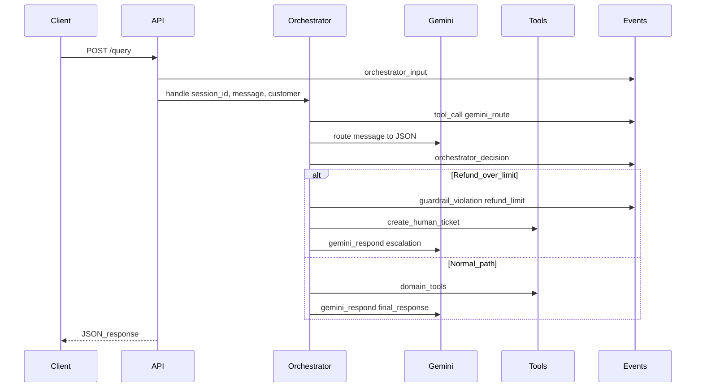
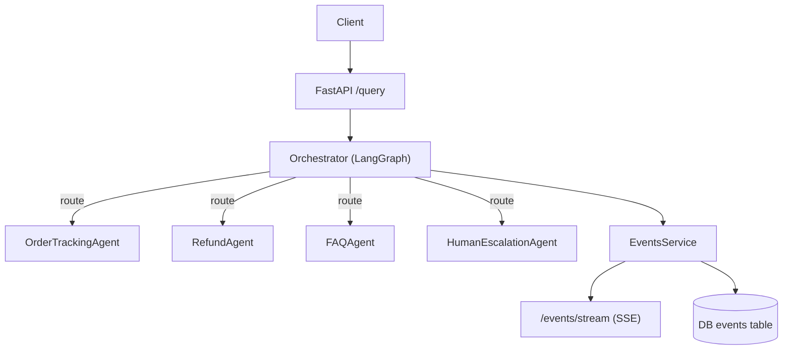

# Agentic Support System (Orchestrator + Specialized Agents)

This repository implements  an **agentic AI system** where an **orchestrator** routes customer queries to specialized agents for:

- Order tracking
- Refund processing (**guardrail: auto-approve only up to $75**)
- FAQ resolution
- Human escalation

It includes **guardrails** (refund limit, session isolation, loop limits) and a **real-time monitoring layer** that logs every decision/tool call/escalation/guardrail violation and streams events live via SSE.

## Tech stack
- **Python**: 3.11+
- **API**: FastAPI
- **Orchestration**: LangGraph
- **LLM**: **Gemini API** (**`gemini-2.5-flash`**) — **required** (routing + responses)
- **Persistence**: SQLAlchemy (defaults to SQLite; supports Postgres via `DATABASE_URL`)
- **Monitoring**: JSON event log + `/events/stream` (SSE) + optional OpenTelemetry export

## Quickstart (Windows / PowerShell)

From the repo root:

```bash
python -m venv .venv
.\.venv\Scripts\Activate.ps1
pip install -r backend\requirements.txt
copy .env.example .env
# Edit .env and set GEMINI_API_KEY before starting
uvicorn backend.app.main:app --reload
```

Service runs at `http://127.0.0.1:8000`.

## Configuration
Copy [`.env.example`](.env.example) to `.env` and adjust:
- `DATABASE_URL`: set to Postgres for production logging
- `REFUND_LIMIT_USD`: auto-approval limit (default 75)
- `MAX_WORKFLOW_STEPS`: loop guard (default 8)
- `GEMINI_API_KEY`: **required**
- `GEMINI_MODEL`: defaults to `gemini-2.5-flash`
- `ADMIN_API_KEY`: required only if you use the `/config/*` admin endpoints

## Notes about “tools”
The integrations in `backend/app/tools/` are **mock implementations** (order status, shipping tracking, refund issuance, ticket creation). They’re intentionally minimal so the focus stays on orchestration, guardrails, and monitoring.

## API
- `GET /health`: health check
- `POST /query`: submit a customer query
- `GET /events?session_id=...`: fetch persisted events for a session
- `GET /events/stream?session_id=...`: live event stream (SSE)

## End-to-end workflow (entire flow)
This is the full runtime path for **every** incoming customer query.

### 1) Submit a query
Client calls `POST /query` with:
- `session_id` (required)
- `customer_id` (required)
- `message` (required)
- `customer` (optional metadata; treated as sensitive and redacted in logs)

### 2) Monitoring logs the input (real time)
An `orchestrator_input` event is emitted (payload redacted).

### 3) Orchestrator routes using Gemini (required)
The orchestrator calls Gemini (**`gemini-2.5-flash`**) to produce JSON:
- `intent`: one of `order_tracking | refund | faq | escalate`
- `confidence`: 0..1
- `extracted`: may include `order_id`, `refund_amount_usd`

Monitoring emits:
- `tool_call` for `gemini_route`
- `metric` for `gemini_route` latency
- `orchestrator_decision` with `source="gemini"`

If confidence is below `ESCALATE_INTENT_CONFIDENCE_BELOW`, the flow escalates immediately.

### 4) Specialized agent executes (tools + guardrails)
Depending on the chosen intent:
- **Order tracking path**
  - Tool calls: `get_order_status` → `get_shipment_tracking`
  - Gemini generates the final user-facing message (`gemini_respond`)
- **Refund path**
  - Tool call: `calculate_refund_eligibility`
  - **Guardrail**: if refund amount > effective limit → emit `guardrail_violation` → escalate to human.
    - The effective limit is either DB override (`PUT /config/refund-limit`) or the env default `REFUND_LIMIT_USD`.
  - Otherwise tool call: `issue_refund`
  - Gemini generates the final user-facing message (`gemini_respond`)
- **FAQ path**
  - Tool call: `faq_search`
  - Gemini generates the final user-facing message (`gemini_respond`)
- **Escalation path**
  - Tool call: `create_human_ticket` (with redacted context)
  - Gemini generates the escalation message (`gemini_respond`)

For each tool call, monitoring emits:
- `tool_call` (with redacted args)
- `metric` (latency + success where applicable)
- `error` if an exception occurs

### 5) Response returned
`POST /query` returns:
- `resolution` (e.g. `refund_approved`, `faq_resolved`, `escalated_to_human`)
- `response` (Gemini-generated user-facing text)
- `escalated` + `escalation_reason` when applicable

### 6) Real-time monitoring and replay
- **Live stream**: open `GET /events/stream?session_id=...` to watch events in real time (SSE).
- **Replay**: call `GET /events?session_id=...` to fetch the persisted audit trail for that session.

### Workflow diagram (runtime)


### Example request

```bash
curl -X POST "http://127.0.0.1:8000/query" ^
  -H "Content-Type: application/json" ^
  -d "{\"session_id\":\"s1\",\"customer_id\":\"c1\",\"message\":\"Refund USD 100 for ORDER12345\",\"customer\":{\"email\":\"user@example.com\"}}"
```

Expected behavior: the refund amount is **above $75**, so the system **blocks** the action and **escalates** to a human ticket, logging a `guardrail_violation` and an `escalation`.

## Architecture (high level)



## Testing
Run the automated tests (no real Gemini calls; Gemini client is stubbed):

```bash
python -m unittest backend.tests.test_app_unittest
```

The test suite validates:
- `/health` works
- refund request **above $75** triggers a `guardrail_violation` and **escalation**
- events are persisted and readable via `GET /events?session_id=...`

### Gemini integration test (optional)
This test **calls the real Gemini API** (costs tokens) and runs **only if** `GEMINI_API_KEY` is set.

```bash
python -m unittest backend.tests.test_app_integration_gemini
```

## Written deliverables
- [`docs/understanding.docx`](docs/understanding.docx)
- [`docs/design-thinking.md`](docs/design-thinking.md)

